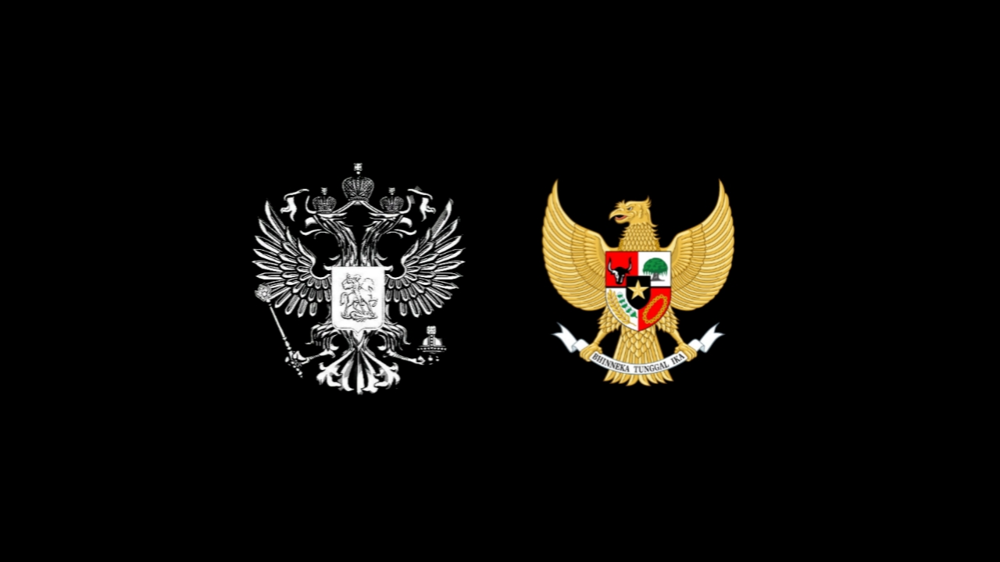

# 🦅 ./Freedom Security ☭
### **Zero-Day Researcher | Cyber Offensive Specialist**  
`Co-Founder @ IZS Group` | `PhD in Cybersecurity` | `Certified Red Teamer (CRTO/CBBH)`  




---

## **🔥 Core Skills**  
### **⌨️ Programming**  


  


### **☁️ Cloud & Infra**  


### **⭐ Certifications**  
| Badge | Certification |
|-------|--------------|
|  | **Certified Ethical Hacker** |
|  | **Certified Red Team Operator** |
|  | **Doctorate in Cybersecurity** |

---

## **💻 My Hacking Setup**  
```bash
# Daily Driver OS
$ sudo apt install hollywood -y # Type sudo when already root💀
```


---

## **📜 Latest 𝘒𝘦𝘨𝘢𝘣𝘶𝘵𝘢𝘯**
### **1. ZeroDay PoC Toolkit**  
   
```python
def exploit_cve_2023_1234():
    print("PoC for ACME Corp RCE - Unpatched!")
```

### **2. Cloud Attack**  
   
```go
func S3BucketRCE() {
  fmt.Println("AWS Misconfig Scanner")
}
```
---


---

## **📫 Let’s Collaborate**  
[](https://linkedin.com/in/yourprofile)
[](https://twitter.com/yourhandle)
[](https://t.me/yourhandle)  

---
## **Big Thanks to all member Kirov Elite Group**
`Sanitize Dark Star` | `Russian Cyber Ford` | `Indonesian Zero Security `

